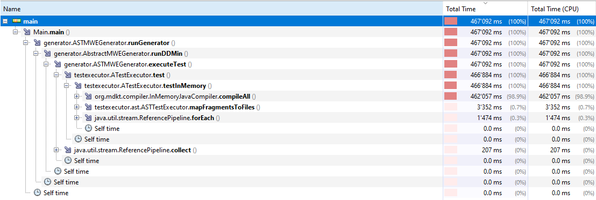

# DDminJ

Implementation of the DDmin algorithm to create a minimal working example (MWE) for Java and written in Java.

## Current results

It is possible to run the algorithm on problems extracted from `defects4j`. 
Using the `defects4j` CLI, a project with a reproducible bug can be downloaded to a folder.
Writing a corresponding run configuration will allow to run the MWEGenerator on this project. 
It is necessary to specify the module-folder, the source folder, the testing folder, the unit-test method and its expected result.

Example: defects4j cli_1
``` 
  C:\Users\lubo9\Desktop\Workspace\defects4j\bugs\cli_1_b
  src\java\
  src\test\
  org.apache.commons.cli.bug.BugCLI13Test#testCLI13
  junit.framework.AssertionFailedError
```

Right now, the compilation of the code in each step of the ddmin algorithm dominates the runtime.



## TODOs

To improve the runtime, two improvements will be attempted:

- [ ] Run the algorithm on a backward slicing of the unit-test run.
  - only consider relevant parts of the code
  - massively reduce the input of the algorithm
- [ ] Integrate static code analysis to the workflow
  - skip compilation if errors are present
  - save time compiling obviously wrong code

## Compilation Type

It is possible to change between command line compilation and execution and the [InMemoryCompiler](https://github.com/trung/InMemoryJavaCompiler).
The measured execution times on a simple example were
- Command line: 151429ms
- In Memory: 7797ms

while delivering the same result. The InMemoryCompiler should be preferred and will be used as the default.

## Code Fragmentation 

There are currently three different code fragmentation methods implemented:

- Single Character
  - The DDmin algorithm is run on the set of all characters of the input problem.
  - This method is very inefficient.
  - Measured execution time: 475622ms
- Code Line
  - The DDmin algorithm is run on the set of code lines of the input problem.
  - It is possible to rerun the algorithm with the output of the previous run, which will improve the overall result.
  - Measured execution time: 
    - Single run: 8197ms
    - With multiple runs: 11726ms
- AST
  - This algorithm is based on the Abstract-Syntax-Tree (AST) of the input problem.
  - Syntactical dependencies of the code  are considered and allow for the usage of the more optimal Hierarchical DDmin (HDD) algorithm.
  - The preprocessing is more involved than with the other algorithms but the actual execution of the algorithm is more efficient.
  - Measured execution time: 6287ms